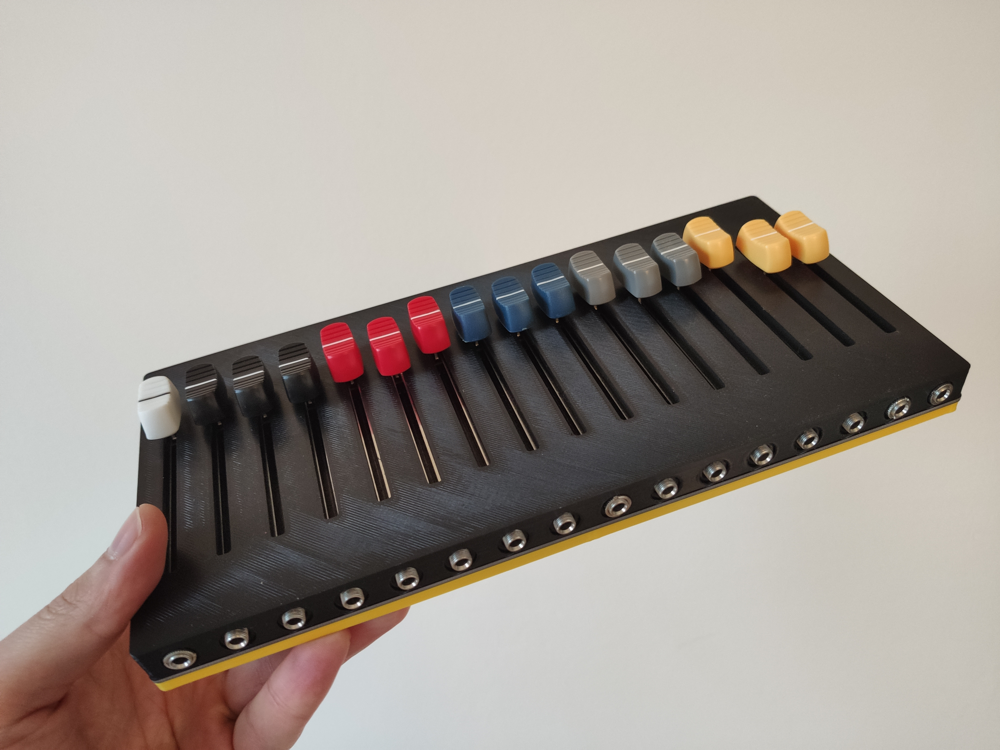

# 16n-faderbank_enclosure

3D printable enclosure for the [16n-faderbank](https://github.com/16n-faderbank/16n).

### :eye: :candy:

### Files

[Fusion360 source](/cad/16n_faderbank_3Dprint.f3d)

[16n_top.stl](/stl/16n_top.stl)
[16n_bottom.stl](/stl/16n_bottom.stl)

### Print settings

 Setting|Value
-:|:-
Material: | PLA
Layer height | 0.2mm
Nozzle: | 0.4mm
Temperature nozzle: | 220°C
Temperature bed: | 60°C

### License

[GNU General Public License v3.0](LICENSE)

